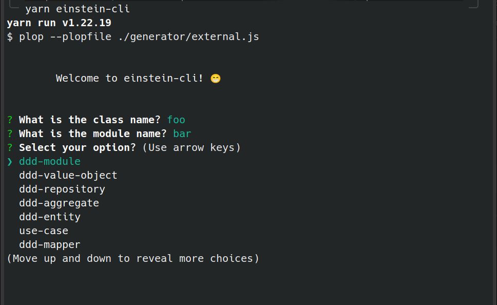

# CLI

A cli to generate domain files

> Important: Support only for linux and WSL. 

**Do Not install globally.**

---

## install in your project

```sh

$ npm install einstein-cli

# OR

$ yarn add einstein-cli

```

Run on your project

```sh

yarn einstein-cli

```



---

## Next Steps

* [ ] Add support to windows
* [ ] Add support for global installation

